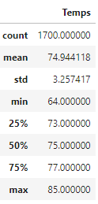
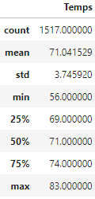

# Surfs Up Analysis
## Project Overview
When determining if it would be advisable to open a surf and ice cream shop in Oahu, an island of Hawaii, a weather database for Hawaii was queried to determine trends in precipitation and temperature on the island throughout the year. Initial analysis showed that there was very little heavy precipitation on the island, and querying temperature data showed that the majority of temperatures scanned where over 67 degrees Farenheit. This data makes Oahu seem promising as a location for a surf and ice cream shop, but more insight into the islands temeratures was requested.
### Purpose
In order to see if Oahu would be a good shop location year-round, the island temperatures for the months of June and December were collected and [analyzed](SurfsUp_Challenge.ipynb). Using SQLAlchemy's `extract` function to create query filters for individual months, the months' temperatures were compiled into dataframes and their summary statistic calculated so that the Summer and Winter months could be compared.
## Results
**June Statistics.....December Statistics**

   


- When comparing the summary statistics between June and December, there is a roughly 200 count difference in datapoints, which might indicate the weather stations are less active during the winter, however, the count difference doesn't seem large enough to dramatically scew the results.
- In both months, the standard deviation, mean, and max temperatures were very similar, indicating that the islands weather is fairly consistent throughout the year.
- The minimum temperature in December is 8 degrees lower than the minimum temp of June, showing that while the average temperatures stay fairly consistent year-round, the temperature may drop lower during the winter months.
## Summary
Overall, the weather on Oahu seems to be ideal for a surf and ice cream shop. From our [analysis](SurfsUp_Challenge.ipynb), it appears that the temperatures remain somewhat consistent throughout the year, meaning the shop can remain open all year without long periods of poor weather driving away customers. Additionally, the precipitation data from our [climate analysis](climate_analysis.ipynb) showed that there were no long, consecutive periods of excessive precipitation that might slow business at the shop. In order to fully examine Oahu's weather in June and December, I would want to examine the precipitation per month. This should be easily accomplished by refactoring the query for June and December's temperatures to collect precipitation instead of temperature:
```
June = session.query(Measurement.date, Measurement.prcp).\
    filter(extract('month', Measurement.date) == 6).all()
```

Another query to run would ask for the average temperatures in June and December, but grouped by year to see if the temperatures would stay the same from year to year.
```
June_averages = session.query(Measurement.date, func.avg(Measurement.tobs)).\
    filter(extract('month', Measurement.date) == 6).group_by(sqlalchemy.func.strftime("%Y", Measurement.date)).all()
```
